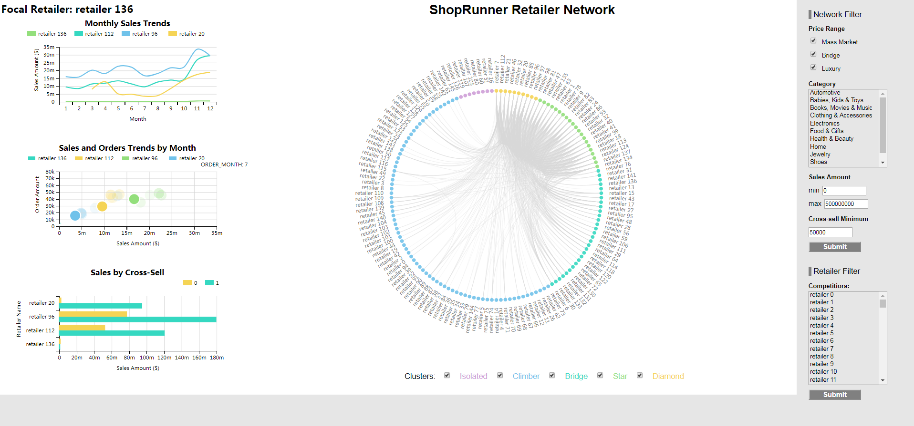

## Overview
This is a demonstration of a retailer network segmentation project that we worked on between January 2018 and June 2018 for a e-commerce company. We analyzed customer orders data and produced valuable insights and tools for our client. The final product of the original project included several presentations, analysis reports and a web-based interactive dashboard. We recreated the main part of this project with completely randomized and re-generated data. This repository will show you our work. 

## App
**Our dashboard is hosted [[here](http://ec2-54-172-116-217.compute-1.amazonaws.com:8000/)]**. Please **open this via your laptop** to achieve best viewing experience. 

**Snapshot:**  

## Team Members
* Xiaowei Li [[GitHub](https://github.com/weiweiweiweili)]
* Junxiong Liu [[GitHub](https://github.com/junxiongliu)]
* Hao Xiao [[GitHub](https://github.com/HaoXiao2018)]
* Wenjing Yang [[GitHub](https://github.com/wyo9057)]
* Tong Yin [[GitHub](https://github.com/Tong-Yin)]

## Important Files
* `data` folder aims to contain all the data. We recreated the raw data by fully adjusting sensitive information via randomization, masking, or hashing. The data can be downloaded from this [[link](https://drive.google.com/open?id=1c3cOjBxsaVJHyBydR_NjhmzaAuLE9Qvw)].
	* `generated` subfolder aims to contain all data generated by files in `scripts\data_creation`. 
	* `raw` subfolder aims to contain raw orders data we recreated for this project. Note that you will only get a sample of this raw data from the download folder. Please contact us if you are interested in more details.
* `scripts` folder contains all scripts that we used in this project.
	* `analysis` subfolder contains scripts to analyze the data.
	* `data_creation` subfolder contains scripts to create the data from raw.
	* `viz` subfolder contains the files to run the visualization.

## General Requirements
Below are some general requirements to reproduce this project:
* `Python 3.6` with common data science libraries such as `numpy`, `pandas`, etc
* `RStudio` version 1.1.419 and `R` version 3.4.3

## Details & Steps To Run
* Data creation/generation: 
	* The data can be downloaded from this [[link](https://drive.google.com/open?id=1c3cOjBxsaVJHyBydR_NjhmzaAuLE9Qvw)]. Plase un-zip it and copy it to the data folder in the root directory **and** copy the `generated` folder to `scripts/viz/data/generated` directory in order to run the visualization. 
	* To recreate the generated data from raw data, please run the following scripts in `scripts/data_creation` folder **in order**: `network_data_aggregation.Rmd`, `analysis_data_preparation.Rmd`, `viz_data_preparation_general.Rmd`, `viz_data_link_establish.Rmd`, and `viz_data_preparation_graph.py`.
* Data Analysis: 
	* `scripts/analysis/analysis.Rmd` file includes a simplified version of our original analysis. 
	* The main objective is to segment retailers in the network in order to inform strategies such as cross-sell. In this analysis, we used various machine learning techniques including unsupervised methods (PCA, Clusterings) as well as supervised approaches (Trees, Regressions).
* Data Visualization: 
	* Copy all data files under `data/generated` folder to `scripts/viz/data`. You can use one command to do this. Go into `scripts/viz` folder first, then type `Xcopy ..\..\data\generated data\` in windows cmd or `cp -r ../../data/generated/. data/` in Linux cmd.
	* Stay in `scripts/viz` folder. Type `python -m http.server` in consle/cmd. Afterwards open up your browser and type `localhost: 8000` (or whatever default port you set up) and you should be able to see the visualization exactly like the screenshot above.
	* In general, the main objective of the visualization is to provide a comprehensive approach to visualize this unique network/orders data. The dashboard is divided into three parts (`Retailer KPI`, `Network Structure`, and `Filters`):
		* `Retailer KPI` is on the left part of the page. It contains three graphs related to focal retailer of your choice and it presents key information such as sales, orders, and cross-sell about the focal retailer against its competitiors.
		* `Network Structure` is on the middle of the page. It contains the structure of the full retailer network where nodes are retailers and edges represent amount of cross-sell between retailers (or a.k.a "customer flow"). The graph is colored by our **clustering results** from the analysis part. 
		* `Filters` is on the right and this section controls the graphs of the other two sections. "Network Filter" controls the `Network Structure` section and "Retailer Filter" controls the `Retailer KPI` section.
			* Note: For `Category` and `Competitiors` boxes, you can press `Ctrl` (for Windows users) to multi-select.
